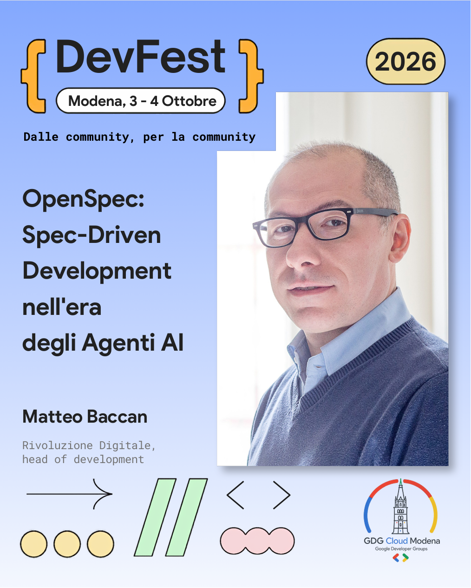

# OpenSpec: Spec-Driven Development nell'era degli agenti AI

In questo repository raccolgo la mia presentazione per il **DevFest Modena 2026** (3/4 ottobre 2026, Modena — track *AI & Machine Intelligence*), dedicata a OpenSpec e allo Spec-Driven Development come approccio operativo per lavorare con agenti AI in modo rigoroso, ripetibile e verificabile.

L'idea centrale che porto avanti è semplice: il problema non è "usare l'AI per scrivere codice", ma evitare che il codice venga generato da prompt vaghi, contesto volatile e decisioni non tracciate. In questa presentazione mostro come OpenSpec sposti il baricentro su specifiche versionate, leggibili dagli umani e vincolanti per gli agenti.

## L'evento

- **Evento:** DevFest Modena 2026
- **Data:** 3/4 ottobre 2026
- **Luogo:** Modena
- **Track:** AI & Machine Intelligence
- **Talk:** OpenSpec: Spec-Driven Development nell'era degli agenti AI — un nuovo paradigma per la collaborazione tra umani e intelligenza artificiale
- **Speaker:** Matteo Baccan




## Tesi

La tesi che sostengo è che il vero salto non sia la velocità di generazione del codice, ma il controllo dell'intento.

Presento OpenSpec come un sistema che trasforma conversazioni effimere in artefatti persistenti:

- nessuna dipendenza da paywall o API key proprietarie come metodo di lavoro;
- zero lock-in verso IDE, modelli o vendor AI;
- intento esplicito e ripetibile, espresso in specifiche che l'agente deve seguire.

## Cosa racconta la presentazione

Ho costruito il deck in sei sezioni:

1. Dal vibe coding a OpenSpec.
   Parto dal problema: agenti AI senza struttura generano vibe coding, con contesto volatile, drift dei requisiti e debito tecnico invisibile. Presento lo Spec-Driven Development come risposta, con la tabella comparativa flusso/artefatti/verificabilità, e introduco OpenSpec: cos'è, i tre pilastri, la filosofia della specifica come fonte della verità, la living documentation, il confronto con gli strumenti di project management e l'agnosticismo verso oltre 30 strumenti AI.

2. La meccanica di OpenSpec.
   Descrivo come la directory `openspec/` funga da memoria a lungo termine dell'agente: la separazione tra `specs/` (l'Essere) e `changes/` (il Divenire), il ruolo di `config.yaml` come costituzione tecnica iniettata attivamente nel contesto, gli artefatti di pianificazione (`proposal.md`, `design.md`, `tasks.md`) e le Delta Specs con i tag `ADDED`, `MODIFIED`, `REMOVED`.

3. Il linguaggio dell'intento.
   Mostro come le parole chiave RFC 2119 (`SHALL`, `MUST`, `SHOULD`) definiscano l'obbligazione, come gli schemi EARS nati in Rolls-Royce aiutino a strutturare la frase del requisito e come gli scenari BDD (`GIVEN`, `WHEN`, `THEN`) ne definiscano la verifica, dando all'agente una base da cui derivare i test.

4. Il ciclo di esecuzione.
   Descrivo OpenSpec come una macchina a stati: `Propose -> Apply -> Archive`, con gate chiari tra allineamento, implementazione e consolidamento. Spiego perché dare a ogni fase un contesto dedicato, un compito alla volta, aumenta la qualità, e come il modello scali con lo sviluppo parallelo su branch e tra repository (Stores, in beta). Chiudo con uno schema d'uso multi-agente (architetto, orchestratore, team di sviluppo AI) che si costruisce sopra gli artefatti di OpenSpec.

5. Nel mondo reale.
   Affronto l'adozione incrementale sul brownfield con `/opsx:explore` e `/opsx:onboard`, la memoria episodica come schema complementare (agente riflettore, agente curatore, playbook eseguibile) e i quattro anti-pattern da evitare.

6. Perché tutto questo conta.
   Chiudo sull'impatto strategico, sulla nascita dell'Agentic Engineer, sul confronto con le alternative (Spec Kit e BMAD: strumenti diversi, stessa scelta di portare l'analisi nel repository) e sulla formula finale: ripetibilità + intento persistente = scalabilità umano-AI.

## I tre pilastri

- `Brownfield-first (1→n)`: far evolvere codebase esistenti, non solo prototipi greenfield (0→1), è un obiettivo condiviso dai framework SDD maturi; OpenSpec ci arriva con le Delta Specs.
- `Architettura leggera`: Markdown + Git come base operativa, senza infrastruttura pesante e senza database complessi.
- `Agnosticismo totale`: zero lock-in verso IDE, modelli o vendor; le specifiche restano nel repository e sopravvivono al cambio di strumento, modello o ambiente.

## Concetti chiave di OpenSpec

- `openspec/`: la directory radice che agisce come memoria a lungo termine dell'agente AI.
- `specs/`: descrive il comportamento corrente del sistema, organizzato per domini logici, ed è la Source of Truth.
- `changes/`: ospita le modifiche proposte in cartelle isolate, senza contaminare lo stato consolidato.
- `config.yaml`: la "costituzione" tecnica del progetto (`schema`, `context`, `rules`), iniettata attivamente nel prompt di pianificazione.
- `proposal.md`: chiarisce perché e cosa si sta cambiando.
- `design.md`: fissa il come tecnico, i vincoli e le scelte architetturali.
- `tasks.md`: spezza il lavoro in task atomici, verificabili ed eseguibili.
- Delta Specs: formalizzano `ADDED`, `MODIFIED`, `REMOVED` per consolidare le modifiche nella Source of Truth.

## Workflow operativo

Nel deck presento OpenSpec come una macchina a stati immutabile a tre fasi:

1. `Propose` (`/opsx:propose`)
   L'agente non scrive codice: allinea l'intento e produce la cartella di modifica con proposal, design, tasks e Delta Specs. Gate: revisione umana dell'intento.

2. `Apply` (`/opsx:apply`)
   L'agente implementa solo dopo approvazione, restando nei confini definiti da `design.md` e `tasks.md`. Gate: verifica qualità sui requisiti MUST/SHALL.

3. `Archive` (`/opsx:archive`)
   Le Delta Specs vengono fuse in `specs/` e la modifica entra nell'archivio storico del progetto, preservando l'audit trail delle decisioni.

Come fase zero opzionale c'è `/opsx:explore`, un "thinking partner" senza vincoli che legge il codice e pesa le alternative prima di formalizzare la proposta. Il profilo esteso aggiunge comandi come `/opsx:verify`, `/opsx:ff`, `/opsx:continue` e `/opsx:onboard`.

## Perché è adatto ai sistemi legacy

Insisto su un punto: OpenSpec non richiede di riscrivere o documentare tutto upfront.

L'adozione può essere incrementale:

- si documenta solo ciò che si tocca, partendo dalla prossima feature o dal prossimo bug critico;
- la Source of Truth cresce organicamente ad ogni ciclo `Propose -> Apply -> Archive`;
- `/opsx:explore` fa leggere all'agente l'area che si sta per toccare prima di proporre, e `/opsx:onboard` offre un tour guidato che porta una piccola modifica reale fino all'archivio: entrambi opzionali, nessuno dei due è un prerequisito per partire.

Come schema complementare, non incluso in OpenSpec, presento anche la memoria episodica: un agente riflettore analizza la cronologia e identifica gli errori, un agente curatore li traduce in regole, e un playbook eseguibile fa sì che l'agente non ripeta gli stessi errori nella sessione.

## Rischi e anti-pattern

Evidenzio quattro errori da evitare:

- il cimitero delle proposte: dimenticare la fase di `Archive` e lasciare change mai consolidate;
- il micro-management dell'AI: scrivere pseudo-codice nelle specifiche principali invece di spostare il "come" in `design.md`;
- la burocrazia per modifiche banali: usare una SDD completa dove basta un approccio leggero (progressive rigor);
- ignorare la formattazione Delta: saltare i tag `ADDED`, `MODIFIED`, `REMOVED` rompe il consolidamento strutturale.

## Impatto strategico

La formula finale che propongo è questa:

`ripetibilità nell'esecuzione` + `resilienza dell'intento` = `scalabilità umano-AI`

Nel concreto, questo significa:

- maggiore accuratezza al primo tentativo, con meno rilavorazioni;
- protezione del know-how architetturale, che resta al team e resiste al turnover;
- un nuovo ruolo per lo sviluppatore — l'Agentic Engineer — più orientato a governare l'intento che a micro-guidare il codice.

Il codice è l'output. La specifica è la competenza.

## Struttura del repository

- `presentation.md`: sorgente Marp della presentazione completa.
- `presentation30min.md`: versione ridotta da 30 minuti con l'essenza del talk, più la slide di chiusura del corner BeeAPro Lab.
- `presentation.pdf`, `presentation30min.pdf`: export PDF delle due versioni, rigenerati dalla GitHub Action a ogni push.
- `img/`: immagini e asset grafici usati nelle slide.
- `template/`: template PowerPoint ufficiali forniti dagli organizzatori.
- `LICENSE`: testo completo della licenza CC BY 4.0 e materiali esclusi.
- `.github/`: metadati del repository.

## Generazione delle slide

Per rigenerare il PDF uso Node.js e questo comando:

```powershell
npx @marp-team/marp-cli presentation.md --pdf --allow-local-files
npx @marp-team/marp-cli presentation30min.md --pdf --allow-local-files
```

## Installazione di OpenSpec su Windows

Per installare OpenSpec su Windows considero necessari Node.js `20.19.0` o superiore e un package manager supportato.

Comandi principali:

```powershell
node --version
npm install -g @fission-ai/openspec@latest
openspec --version
cd your-project
openspec init
```

Riferimenti ufficiali:

- Installazione: <https://github.com/Fission-AI/OpenSpec/blob/main/docs/installation.md>
- Documentazione generale: <https://github.com/Fission-AI/OpenSpec/tree/main/docs>
- Repository OpenSpec upstream: <https://github.com/Fission-AI/OpenSpec>

## Crediti

Per preparare queste slide devo ringraziare:

- Anthropic, per l'abbonamento Claude Code Max regalato per i miei contributi al mondo open source.
- Claude, per aver convertito il template PowerPoint in un template Marp in markdown.
- Nano Banana Pro, per le immagini.
- NotebookLM, per la prima scaletta e i riassunti dei podcast e video.
- VS Code, per la gestione del repository.
- Marp, per la generazione della presentazione.

## Licenza

I contenuti originali di questo repository (slide, testi, struttura del talk) sono rilasciati con licenza [Creative Commons Attribuzione 4.0 Internazionale (CC BY 4.0)](https://creativecommons.org/licenses/by/4.0/deed.it).

Sei libero di condividerli e adattarli, anche per fini commerciali, a condizione di citare la fonte:

> "OpenSpec: Spec-Driven Development nell'era degli agenti AI" di Matteo Baccan (<https://www.baccan.it>), CC BY 4.0.

Restano esclusi dalla licenza i marchi, i loghi e i template di terze parti presenti nel repository, in particolare quelli di DevFest, GDG, Google e BeeAPro: appartengono ai rispettivi titolari e il loro riutilizzo richiede una specifica autorizzazione. L'elenco completo è nel file [`LICENSE`](LICENSE).

## Autore

Matteo Baccan  
Sito: <https://www.baccan.it>


> "Smetti di chattare, inizia a governare."
